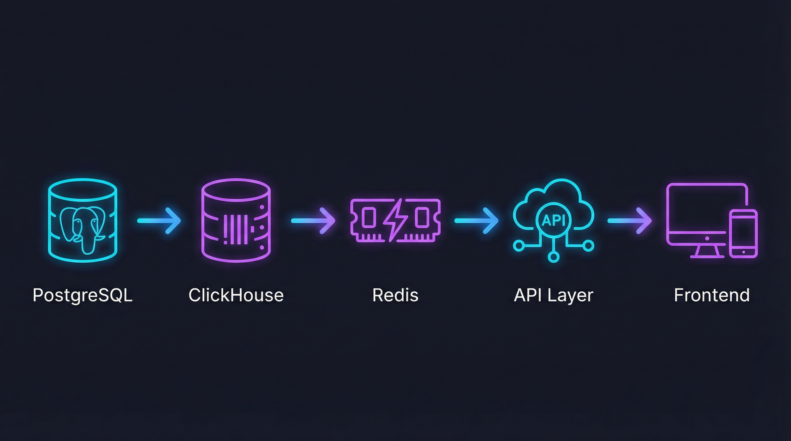
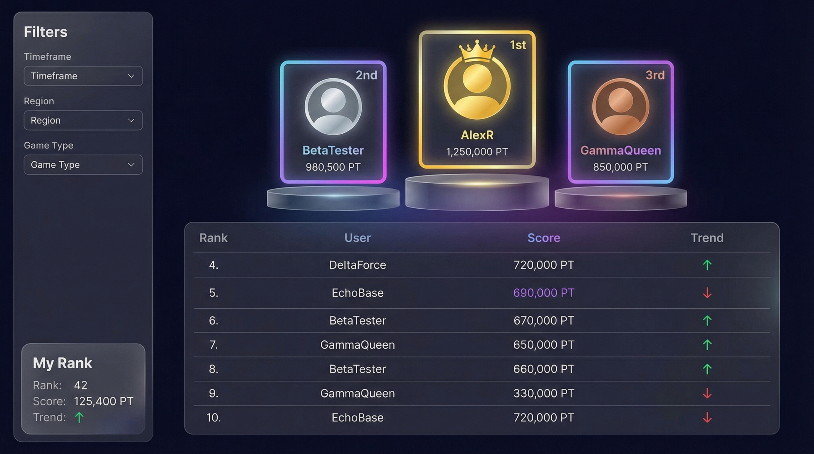

# 全站排行榜功能设计文档

> **项目**: LINUX DO Credit
> **版本**: v1.0
> **日期**: 2025-12-29

---

## 目录

1. [功能概述](#1-功能概述)
2. [系统架构](#2-系统架构)
3. [后端设计](#3-后端设计)
4. [前端设计](#4-前端设计)
5. [实施计划](#5-实施计划)

---

## 1. 功能概述

### 1.1 目标

为 LINUX DO Credit 提供基于 ClickHouse 的全站排行榜系统，支持：

- **多周期筛选**: day / week / month / all_time
- **多指标排名**: 交易额、净流入、收款/付款/转账等
- **高性能分页**: 支持万级用户快速查询
- **近实时更新**: 数据延迟从 T+1 降到分钟级

### 1.2 业务价值

| 维度         | 描述                         |
| ------------ | ---------------------------- |
| **用户激励** | 排名可视化激发用户活跃度     |
| **平台运营** | 识别高价值用户，辅助运营决策 |
| **社区氛围** | 排行榜增强竞争与社交属性     |

---

## 2. 系统架构

### 2.1 架构图



### 2.2 数据流

```
┌─────────────┐    增量同步     ┌─────────────┐    聚合计算    ┌─────────────────────┐
│  PostgreSQL │ ──────────────→ │  ClickHouse │ ────────────→ │ user_daily_metrics  │
│   orders    │    (分钟级)     │   orders    │   (5分钟)     │                     │
└─────────────┘                 └─────────────┘               └──────────┬──────────┘
                                                                          │
                                                                   排名快照生成
                                                                     (5-60分钟)
                                                                          │
                                                                          ▼
┌─────────────┐    API 查询     ┌─────────────┐    缓存读取    ┌─────────────────────┐
│   Frontend  │ ←────────────── │   Go API    │ ←──────────── │       Redis         │
│  React 19   │                 │  Gin + CH   │               │    (热数据缓存)      │
└─────────────┘                 └─────────────┘               └─────────────────────┘
```

### 2.3 技术栈

| 层级         | 技术选型                                             |
| ------------ | ---------------------------------------------------- |
| **前端**     | Next.js 16 + React 19 + Tailwind v4 + Shadcn UI      |
| **后端**     | Go 1.23 + Gin + GORM + Asynq                         |
| **数据存储** | PostgreSQL (主库) + ClickHouse (分析) + Redis (缓存) |
| **可视化**   | @tanstack/react-virtual + framer-motion + Recharts   |

---

## 3. 后端设计

### 3.1 API 设计

#### 3.1.1 获取排行榜列表

```
GET /api/v1/leaderboard
```

**Query 参数**

| 参数        | 类型   | 默认值          | 说明                                  |
| ----------- | ------ | --------------- | ------------------------------------- |
| `period`    | string | `all_time`      | `day` / `week` / `month` / `all_time` |
| `date`      | string | 今日            | `YYYY-MM-DD`，用于定位周期            |
| `metric`    | string | `volume_amount` | 排名指标                              |
| `page`      | int    | 1               | 页码 (≥1)                             |
| `page_size` | int    | 50              | 每页数量 (1-100)                      |

**指标枚举**

| metric                | 说明                  |
| --------------------- | --------------------- |
| `receive_amount`      | 收款总额              |
| `payment_amount`      | 付款总额              |
| `transfer_in_amount`  | 转入总额              |
| `transfer_out_amount` | 转出总额              |
| `volume_amount`       | 活跃交易额 (全部相加) |
| `net_amount`          | 净流入 (收-付)        |

**Response**

```json
{
    "error_msg": "",
    "data": {
        "period": {
            "type": "all_time",
            "start": "1970-01-01",
            "end": "2100-01-01"
        },
        "metric": "volume_amount",
        "snapshot_at": "2025-12-29T09:10:00+08:00",
        "page": 1,
        "page_size": 50,
        "total": 12345,
        "items": [
            {
                "rank": 1,
                "user_id": 10001,
                "username": "alice",
                "avatar_url": "https://...",
                "score": "123456.78"
            }
        ]
    }
}
```

#### 3.1.2 获取我的排名

```
GET /api/v1/leaderboard/me
```

**需要登录**: `oauth.LoginRequired()`

**Response**

```json
{
    "error_msg": "",
    "data": {
        "period": {
            "type": "month",
            "start": "2025-12-01",
            "end": "2026-01-01"
        },
        "metric": "payment_amount",
        "snapshot_at": "2025-12-29T09:10:00+08:00",
        "user": { "user_id": 10001, "rank": 42, "score": "9876.00" }
    }
}
```

#### 3.1.3 获取指定用户排名

```
GET /api/v1/leaderboard/users/:id
```

#### 3.1.4 获取元数据

```
GET /api/v1/leaderboard/metadata
```

```json
{
    "error_msg": "",
    "data": {
        "periods": ["day", "week", "month", "all_time"],
        "metrics": [
            { "key": "volume_amount", "name": "活跃交易额" },
            { "key": "payment_amount", "name": "付款总额" }
        ],
        "timezone": "Asia/Shanghai",
        "defaults": {
            "period": "all_time",
            "metric": "volume_amount",
            "page_size": 50
        }
    }
}
```

### 3.2 ClickHouse 数据模型

#### 3.2.1 用户日聚合表

```sql
CREATE TABLE IF NOT EXISTS user_daily_metrics
(
    dt Date,
    user_id UInt64,

    receive_amount       Decimal(20, 2),
    payment_amount       Decimal(20, 2),
    transfer_in_amount   Decimal(20, 2),
    transfer_out_amount  Decimal(20, 2),

    receive_count        UInt32,
    payment_count        UInt32,
    transfer_in_count    UInt32,
    transfer_out_count   UInt32,

    success_order_count  UInt32,
    computed_at          DateTime,

    INDEX idx_user_id user_id TYPE bloom_filter(0.01) GRANULARITY 4
)
ENGINE = ReplacingMergeTree(computed_at)
PARTITION BY toYYYYMM(dt)
ORDER BY (dt, user_id)
SETTINGS index_granularity = 8192;
```

#### 3.2.2 周期排名快照表

```sql
CREATE TABLE IF NOT EXISTS leaderboard_period_rankings
(
    period_type  LowCardinality(String),   -- day/week/month/all_time
    period_start Date,
    period_end   Date,

    metric       LowCardinality(String),   -- volume_amount 等
    snapshot_at  DateTime,                 -- 快照时间

    rank         UInt32,                   -- 1-based
    user_id      UInt64,
    score        Decimal(20, 2),

    INDEX idx_user_id user_id TYPE bloom_filter(0.01) GRANULARITY 4
)
ENGINE = MergeTree
PARTITION BY (period_type, toYYYYMM(period_start))
ORDER BY (period_type, period_start, metric, snapshot_at, rank)
TTL snapshot_at + INTERVAL 30 DAY DELETE
SETTINGS index_granularity = 8192;
```

### 3.3 高效查询模式

#### 列表分页 (按 rank 范围，避免 OFFSET)

```sql
SELECT rank, user_id, score
FROM leaderboard_period_rankings
WHERE period_type = {period_type:String}
  AND period_start = {period_start:Date}
  AND metric = {metric:String}
  AND snapshot_at = {snapshot_at:DateTime}
  AND rank BETWEEN {rank_from:UInt32} AND {rank_to:UInt32}
ORDER BY rank ASC;
```

#### 用户排名查询

```sql
SELECT rank, score
FROM leaderboard_period_rankings
WHERE period_type = {period_type:String}
  AND period_start = {period_start:Date}
  AND metric = {metric:String}
  AND snapshot_at = {snapshot_at:DateTime}
  AND user_id = {user_id:UInt64}
LIMIT 1;
```

### 3.4 Redis 缓存策略

**Key 设计**

| 用途     | Key 模式                                                    | TTL     |
| -------- | ----------------------------------------------------------- | ------- |
| 元信息   | `leaderboard:v1:meta:{period_type}:{period_start}:{metric}` | 60s     |
| 列表缓存 | `leaderboard:v1:list:...p:{page}:s:{page_size}`             | 30-120s |
| 用户排名 | `leaderboard:v1:user:{user_id}:...`                         | 30-120s |

**防击穿**

- 缓存未命中时使用 Redis 分布式锁
- 任务完成后预热热门页

### 3.5 Asynq 任务设计

| 任务类型                                   | 调度频率  | 说明                             |
| ------------------------------------------ | --------- | -------------------------------- |
| `order:sync_to_clickhouse_incremental`     | 每分钟    | 增量同步 PostgreSQL → ClickHouse |
| `leaderboard:aggregate:user_daily_metrics` | 每 5 分钟 | 聚合最近 2 天数据                |
| `leaderboard:compute:period_rankings`      | 5-60 分钟 | 生成排名快照 + 写入 Redis 元信息 |

### 3.6 Go 代码结构

```
internal/apps/leaderboard/
├── routers.go          # Gin handlers
├── dto.go              # 请求/响应结构体
├── service.go          # 业务编排
├── repo_clickhouse.go  # ClickHouse 查询
├── repo_postgres.go    # 用户信息查询
└── tasks.go            # Asynq 任务 handler
```

**路由注册** (`internal/router/router.go`)

```go
leaderboardRouter := apiV1Router.Group("/leaderboard")
{
    leaderboardRouter.GET("", leaderboard.List)
    leaderboardRouter.GET("/metadata", leaderboard.Metadata)
    leaderboardRouter.GET("/me", oauth.LoginRequired(), leaderboard.Me)
    leaderboardRouter.GET("/users/:id", leaderboard.User)
}
```

---

## 4. 前端设计

### 4.1 UI 概念图



### 4.2 设计系统

#### 排名配色

| 排名         | Light Mode | Dark Mode | Tailwind Class   |
| ------------ | ---------- | --------- | ---------------- |
| **🥇 第1名** | `#F59E0B`  | `#FBBF24` | `text-amber-500` |
| **🥈 第2名** | `#64748B`  | `#94A3B8` | `text-slate-500` |
| **🥉 第3名** | `#B45309`  | `#D97706` | `text-amber-700` |
| **当前用户** | `#2563EB`  | `#3B82F6` | `bg-blue-600`    |

### 4.3 页面布局

#### 桌面端 (lg+)

```
[ 筛选侧栏 (2col) ]  [    领奖台 Top 3    ]  [ 用户统计 (3col) ]
[    Sticky        ]  [    虚拟列表 4+     ]  [     Sticky       ]
                      [    (Center 7col)   ]
```

#### 移动端 (md-)

1. 标题 + 筛选切换
2. 可折叠的"我的排名"卡片
3. 横向滚动领奖台
4. 无限滚动列表
5. 底部固定"我的排名"条

### 4.4 组件架构

```
LeaderboardPage (Server Component)
└── LeaderboardLayout
    ├── FilterSidebar
    │   └── FilterGroup (Radio/Select)
    ├── MainContent
    │   ├── LeaderboardPodium
    │   │   ├── PodiumItem (1st) 🥇
    │   │   ├── PodiumItem (2nd) 🥈
    │   │   └── PodiumItem (3rd) 🥉
    │   └── LeaderboardTable
    │       └── VirtualList (@tanstack/react-virtual)
    │           └── RankRowItem
    │               ├── TrendIndicator
    │               └── UserAvatarWithDecoration
    └── UserStatsSidebar
        ├── CurrentUserRankCard
        └── ShareButton
```

### 4.5 交互设计

#### 领奖台入场动画 (framer-motion)

```typescript
const container = {
    hidden: { opacity: 0 },
    show: {
        opacity: 1,
        transition: { staggerChildren: 0.2 },
    },
};

const item = {
    hidden: { y: 50, opacity: 0 },
    show: { y: 0, opacity: 1 },
};
```

#### 排名提升庆祝

- 使用 `canvas-confetti` 撒花效果
- 触发条件: `previousRank > currentRank`

#### 数字滚动

- 使用 `framer-motion` 的 `useSpring` 实现分数滚动

### 4.6 数据获取

```typescript
// hooks/use-leaderboard.ts

export const useLeaderboard = ({ period, metric }: FilterParams) => {
    return useInfiniteQuery({
        queryKey: ["leaderboard", period, metric],
        queryFn: ({ pageParam }) => fetchLeaderboard({ ...pageParam }),
        getNextPageParam: (lastPage) => lastPage.nextCursor,
    });
};

export const useUserRank = (userId: string) => {
    return useQuery({
        queryKey: ["user-rank", userId],
        queryFn: () => fetchUserRank(userId),
    });
};
```

### 4.7 响应数据结构

```typescript
interface LeaderboardEntry {
    userId: string;
    rank: number;
    previousRank: number;
    score: number;
    user: {
        username: string;
        avatarUrl: string;
        decorations: string[];
    };
    stats: {
        trend: "up" | "down" | "same";
        trendValue: number;
    };
}
```

### 4.8 无障碍 (a11y)

- 领奖台使用 `<ol>` 有序列表
- 虚拟列表使用 `role="feed"` + `role="article"`
- 排名变化语义化: "第1名，较昨日上升2位"
- 颜色不作为唯一信息传递方式

---

## 5. 实施计划

### Phase 1: 基础设施

- [ ] 创建 ClickHouse 表 (`user_daily_metrics`, `leaderboard_period_rankings`)
- [ ] 实现增量同步任务 (`order:sync_to_clickhouse_incremental`)
- [ ] 实现聚合任务 (`leaderboard:aggregate:user_daily_metrics`)

### Phase 2: 后端 API

- [ ] 创建 `internal/apps/leaderboard` 模块
- [ ] 实现 4 个 API 端点
- [ ] 接入 Redis 缓存策略

### Phase 3: 前端实现

- [ ] 创建页面路由 `app/(main)/leaderboard/page.tsx`
- [ ] 实现 Podium、Table、Filter 组件
- [ ] 接入 @tanstack/react-virtual 虚拟化

### Phase 4: 优化与测试

- [ ] 压测 ClickHouse 查询性能
- [ ] 移动端响应式适配
- [ ] 深色模式验证

---

## 附录

### A. 对接现有代码

| 能力            | 文件位置                                  |
| --------------- | ----------------------------------------- |
| ClickHouse 连接 | `internal/db/clickhouse.go` → `db.ChConn` |
| 订单同步任务    | `internal/apps/order/tasks.go`            |
| 用户模型        | `internal/model/users.go`                 |
| HTTP 响应       | `internal/util/response.go`               |

### B. 扩展方向

- 按 `client_id` 分榜（商户榜/客户榜）
- 按 `users.pay_score` 排名
- 实时 WebSocket 推送排名变化
